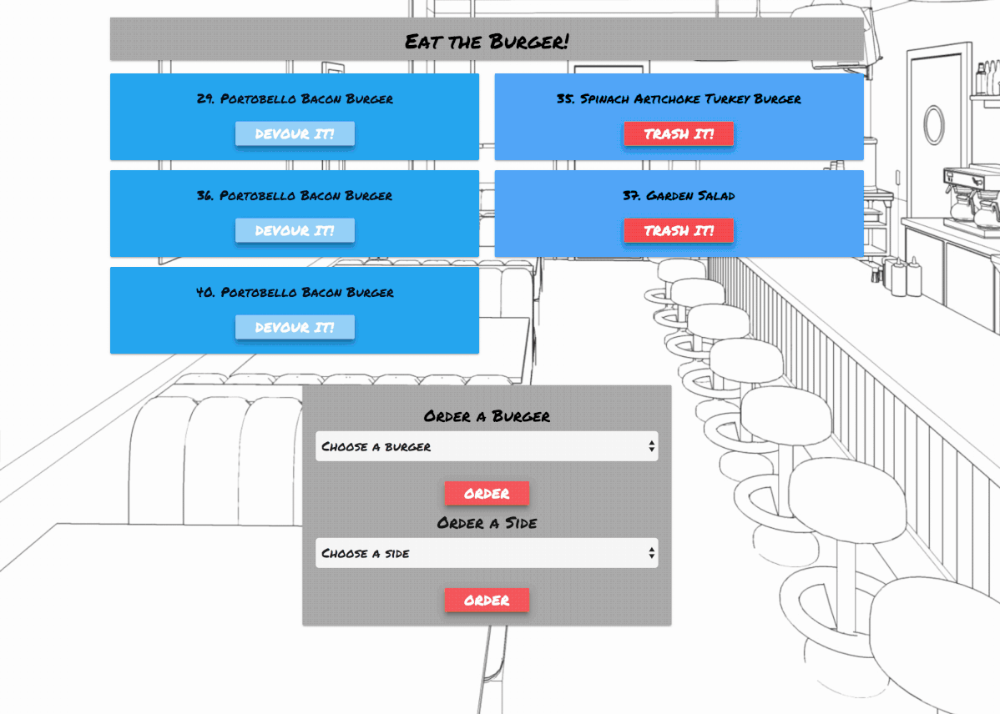

# Burger
University of Denver Coding Bootcamp Week 14 - Eat the Burger!

 ```
Welcome to Eat the Burger! This is an a simple app that allows you to order Burgers of you choice and side items. 

Within the "Restaurant", use the drop-down menus to choose what you would like to eat, and press the "ORDER" button to place an order.
This will add those items to to left ready for consumption. When your ready to eat click the "DEVOUR IT!" 

After you're done, you can remove the items by sending them to the TRASH IT!.


Happy eating!
 ```

### As seen here.



### Built With

```
* MySQL
* Node.JS
* JavaScript
* Handlebars.js
* Body-parser
* Sequelize

```

### Contributing

```
There are different ways to contribute
* Back End
* Designers
* Genius Idea's
* Unit Testers
* etc.
```

### Contributers

```
* Dennis Platts-Dethman
```

